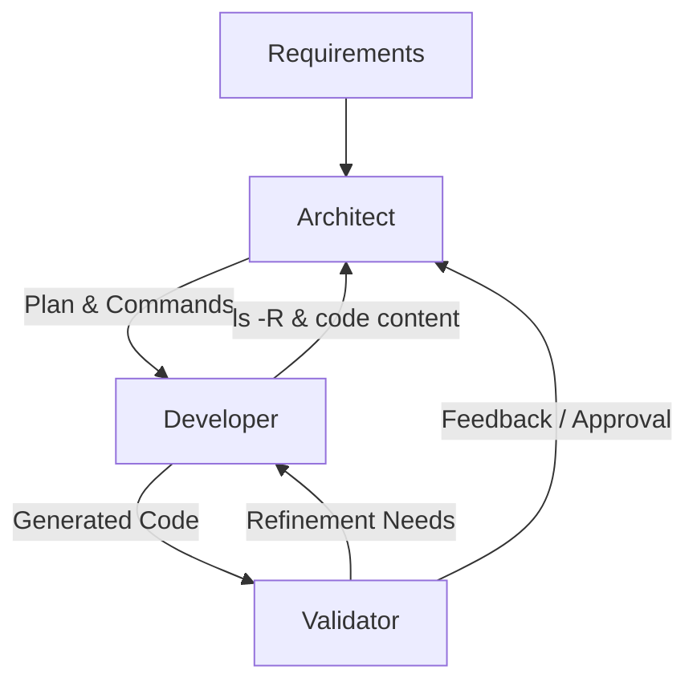

# AI Agent Roles & Relations for fsd-generator

When multiple agents collaborate on a project using `fsd-gen`, they should adopt specific roles to ensure architectural integrity and code quality.

## Role Definitions

### 1. Architect (The Planner)
- **Responsibility**: Strategic decision-making and project structure.
- **Actions**:
    - Analyzes business requirements (e.g., "We need a <feature_description>").
    - Decides on the FSD layering (e.g., "This requires an `<entity_slice>`, a `<feature_slice>`, and a `<page_slice>`").
    - Selects the appropriate CLI tool: `generate` for atomic parts or `preset` for vertical slices.
- **Output**: A technical plan or a list of CLI commands for the Developer.

### 2. Developer (The Executor)
- **Responsibility**: Precise execution of CLI commands and boilerplate refinement.
- **Actions**:
    - Executes `fsd-gen` commands as instructed by the Architect using specific `<layer>`, `<slice>`, and `<name>` values.
    - Resolves any file path conflicts or configuration issues.
    - Adds business-specific logic into the generated UI/model files.
- **Output**: Generated and refined code files.

### 3. Validator (The Auditor)
- **Responsibility**: Quality assurance and FSD compliance.
- **Actions**:
    - Verifies that generated files are in the correct FSD folders for the chosen `<layer>`.
    - Checks `<rootDir>/<layer>/<slice>/index.ts` (Public API) for correct exports.
    - Runs tests and lint checks.
    - Confirms that cross-slice imports are not violating FSD boundaries (e.g., entity importing from feature).
- **Output**: Verification report or "Ready to Merge" approval.

## Role Relations & Information Flow

1. **Architect** interprets requirements and gives commands to **Developer**.
2. **Developer** executes commands and provides the state of the filesystem back to the **Architect**.
3. **Validator** reviews the **Developer's** output and provides a final check before the task is considered complete.
